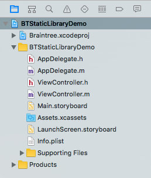
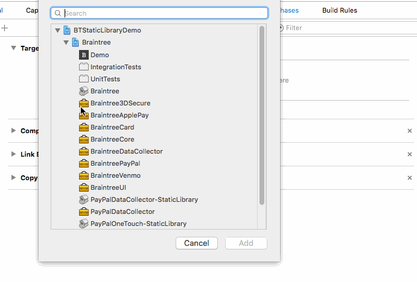

Static Library Integration Guide
------------------------------------

Please follow these instructions to integrate Braintree iOS into your app using the provided static library.

> Note: We assume that you are using Xcode 8+ and iOS 9.0+ as your Base SDK.

1. Add the Braintree iOS SDK code to your repository
  - [Download the SDK as a ZIP file from GitHub](https://github.com/braintree/braintree_ios/archive/master.zip) and unzip it into your app's root directory in Finder

2. Open up your app in Xcode

3. Add Braintree as a subproject
  - Open your project and drag the Braintree.xcodeproj file to your Project Navigator under your project. Be sure *NOT* to have the Braintree.xcodeproj open while doing this step.
  
  
  
4. Add `Braintree` to your build phases (`[Your App Target]` > `Build Phases`)
  - `Target Dependencies`
    - Click the `+` and add `Braintree`
    
    
    
  - `Link Binary With Libraries`
    - Click the `+` and add `libBraintree.a`
    
    
    
5. Add `localized strings` to `Copy Bundle Resources` (`[Your App Target]` > `Build Phases`)
  - In the Project Navigator, locate the `UI.strings` (`Braintree.xcodeproj` > `BraintreeUI` > `Localization` > `UI.strings`)
  - Drag the `UI.strings` file from the Navigator to the `Copy Bundle Resources` panel and drop it
  - Repeat for remaining localized strings
    - `Drop-In.strings` (`Braintree.xcodeproj` > `BraintreeUI` > `Drop-In` > `Localization` > `Drop-In.strings`)
    - `Three-D-Secure.strings` (`Braintree.xcodeproj` > `Braintree3DSecure` > `Localization` > `Three-D-Secure.strings`)
  
  
  
6. Modify your build settings (`[Your App Target]` > `Build Settings`)
  - Update `Header Search Paths`
    - Add `$(PROJECT_DIR)/braintree_ios` (or whatever the name of the braintree folder at the top level of your project is)
    - Be sure to select recursive from the drop down at the right
    
    
    
  - Update `Other Linker Flags`
    - Add `-ObjC`
    
    
    
7. `Build and Run` your app to test out the integration

8. [Integrate the SDK in your checkout form](https://developers.braintreepayments.com/ios/start/overview)
